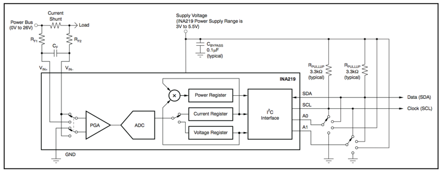


This article was previously published at http://cdwilson.us/articles/understanding-the-INA219/


## Motivation

The [INA219 datasheet][] provides an example calibration workflow, but doesn't really explain how some of the equations and constant values are derived.  This article tries to fill in some of the gaps that weren't obvious to me when I first read the datasheet.

## Overview

> "The INA219 is a high-side current shunt and power monitor with an I2C interface. The INA219 monitors both shunt drop and supply voltage, with programmable conversion times and filtering. A programmable calibration value, combined with an internal multiplier, enables direct readouts in amperes. An additional multiplying register calculates power in watts. The I2C interface features 16 programmable addresses."

The [INA219][] calculates the current flowing through the "Current Shunt" sense resistor by first measuring the voltage across the resistor, and then applying Ohm’s law,

$$
I_{shunt}=\frac{V_{shunt}}{R_{shunt}}
$$

Bus voltage is measured directly on the load side of the shunt resistor ($V_{IN-}$).

Power is then calculated by multiplying these two sampled values,

$$
Power = I_{shunt} \cdot V_{shunt}
$$

## Shunt and Bus Voltage Measurements

When measuring the shunt voltage, the internal [ADC][] converts the analog voltage into a digital value which is stored in binary representation in the _Shunt Voltage Register_. The INA219 uses a 12-bit ADC, meaning it can resolve the analog voltage into $2^{12}$ (4096) discrete digital values. The ADC can measure voltages in the range of ±40mV (± for bidirectional current measurement). In order to extend this range, the INA219 has a [PGA][] in front of the ADC that can be configured to divide the input voltage by a factor of 1, 2, 4, or 8. This gives the INA219 an effective range of ±40mV, ±80mV, ±160mV, or ±320mV respectively.

The _Shunt Voltage Register_ is a signed 16-bit register, so you may be wondering how the 12-bit ADC can generate 16 bits of information?  It turns out that the INA219 can be configured to average 2-128 samples to generate an average shunt voltage measurement.  This averaging operation can provide additional resolution in the lowest 1, 2, or 3 bits when the shunt voltage range is set for ±80mV, ±160mV, or ±320mV respectively.

Similarly, the ADC converts the analog bus voltage ($V_{IN-}$) into a digital value and stores the result in the _Bus Voltage Register_. The full-scale BRNG can be selected between 16V and 32V (default), and there are 13 bits in the _Bus Voltage Register_ that can be used for storing the bus voltage value.  When using the 32V BRNG setting, the bus voltage is divided by 2 in the PGA before being sampled by the ADC.  In this mode, the lowest bit may provide additional resolution if averaging is enabled.

The [LSB][] step size specified in the data sheet can be verified as follows,

$$
LSB_{Shunt\ Voltage\ Register} = \frac{40mV}{4096} = 9.77μV \approx 10μV
$$

$$
LSB_{Bus\ Voltage\ Register} = \frac{16V}{4096} = 3.90mV \approx 4mV
$$

The raw values in the voltage registers can be converted to real voltage values by multiplying by the LSB step size,

$$
\boxed{V_{shunt} = Shunt\ Voltage\ Register \cdot 10μV}
$$

$$
\boxed{V_{bus} = Bus\ Voltage\ Register \cdot 4mV}
$$

This is generally applicable to all measurement registers in the INA219. The real world quantities that are represented by the register values can be obtained by simply multiplying the register value by the LSB step size,

$$
\boxed{Sampled\ Value = Register\ Value \cdot LSB}
$$

## Calibrating the INA219

Since the device cannot detect the value of $R_{shunt}$, the _Calibration Register_ is used to inform the power measurement engine about the shunt resistance value. However, instead of specifying the value of $R_{shunt}$ directly, for the same $R_{shunt}$ value, the _Calibration Register_ can be programmed differently depending on the type of result that is desired in the _Current_ and _Power Registers_. From the datasheet,

> “The Calibration Register can also be selected to provide values in the Current and Power Registers that either provide direct decimal equivalents of the values being measured, or yield a round LSB number."

The power management engine calculates the _Current_ and _Power Register_ values according to the following equations,

$$
\boxed{Current\ Register = \frac{Shunt\ Voltage\ Register \cdot Calibration\ Register}{4096}}
$$

$$
\boxed{Power\ Register = \frac{Current\ Register \cdot Bus\ Voltage\ Register}{5000}}
$$

Therefore, the _Calibration Register_ value is simply a system-dependent scaling factor that converts the shunt voltage into current.

Starting with the equation for the shunt current,

$$
\boxed{I_{shunt} = Current\ Register \cdot LSB_{current}}
$$

Ohm’s law can be used to rearrange the equation for the _Current Register_,

$$
Current\ Register = \frac{I_{shunt}}{LSB_{current}} = \frac{V_{shunt}}{R_{shunt}} \cdot \frac{1}{LSB_{current}}
$$

Substituting for $V_{shunt}$,

$$
Current\ Register = \frac{Shunt\ Voltage\ Register \cdot 10μV}{R_{shunt}} \cdot \frac{1}{LSB_{current}}
$$

Setting both _Current Register_ equations equal to each other, it’s possible to solve for the _Calibration Register_,

$$
\frac{Shunt\ Voltage\ Register \cdot Calibration\ Register}{4096} = \frac{Shunt\ Voltage\ Register \cdot 10μV}{R_{shunt}} \cdot \frac{1}{LSB_{current}}
$$

$$
Calibration\ Register = trunc\left(\frac{10μV \cdot 4096}{LSB_{current} \cdot R_{shunt}} \cdot \frac{1V}{100000 \cdot 10μV}\right)
$$

$$
\boxed{Calibration\ Register = trunc\left(\frac{0.04096}{LSB_{current} \cdot R_{shunt}}\right)}
$$

## Programming the _Calibration Register_

The [INA219 datasheet] provides a couple examples of how to program the _Calibration Register_. This example follows the same procedure described in the datasheet, where general equations are $\boxed{boxed}$, and followed by specific examples:

1.  Determine the maximum bus voltage ($V_{bus\ max}$) for the system and configure BRNG based upon this value (16V or 32V):

    $V_{bus\ max} = 16V$ (BRNG = 0)

2.  Determine the maximum shunt voltage ($V_{shunt\ max}$) for the system and configure PGA gain based upon this value (÷ 1, ÷ 2, ÷ 4, or ÷ 8):

    $V_{shunt\ max} = 40mV$ (PGA = ÷ 1)

3.  Determine the value of the shunt resistor ($R_{shunt}$):

    $R_{shunt} = 0.04Ω$

4.  Based _only_ on the values selected in the first three steps, calculate the maximum current that could possibly flow through the sense resistor:

    $$
    \boxed{I_{max\ possible} = \frac{V_{shunt\ max}}{R_{shunt}}}
    $$

    $$
    I_{max\ possible} = \frac{40mV}{0.04Ω} = 1A
    $$

5.  Based on expected system performance, determine the actual _expected_ maximum current where $I_{max\ expected} \leq I_{max\ possible}$.

    For this system, let’s assume that it’s expected to draw up to 1A of current,

    $$
    I_{max\ expected} = I_{max\ possible} = 1A
    $$

6.  The _Current Register_ is 16 bits wide, but since the device can measure bidirectional current, the [MSB][] is used to indicate the sign in two’s compliment representation. Therefore, the remaining 15 bits can be used to represent the entire $I_{max\ expected}$ current range. Since the ADC resolution is 12 bits, it is desirable to choose the _Current Register_ resolution between 12-15 bits, ideally as close to the 15-bit resolution as possible.

    Calculate the minimum current LSB (15-bit resolution):

    $$
    \boxed{LSB_{minimum} = \frac{I_{max\ expected}}{32767}}
    $$

    $$
    LSB_{minimum} = \frac{1A}{32767} = 30.51850948μA
    $$

    Calculate the maximum current LSB (12-bit resolution):

    $$
    \boxed{LSB_{maximum} = \frac{I_{max\ expected}}{4096}}
    $$

    $$
    LSB_{maximum} = \frac{1A}{4096} = 244.140625μA
    $$

    Choose a current LSB value, where $LSB_{minimum}$[^1] $\lt LSB_{current} \lt LSB_{maximum}$[^2]. From the data sheet,

    > "Note that the results will have the most resolution when the minimum LSB is selected. Typically, an LSB is selected to be the nearest round number to the minimum LSB value."

    Let’s choose $LSB_{current} = 31μA$.

7.  Compute the _Calibration Register_ value:

    $$
    \boxed{Calibration\ Register = trunc\left(\frac{0.04096}{LSB_{current} \cdot R_{shunt}}\right)}
    $$

    $$
    Calibration\ Register = trunc\left(\frac{0.04096}{31μA \cdot 0.04Ω}\right) = 33032 = 0x8108
    $$

8.  The digital designers of the INA219 designed the power management engine to calculate the _Power Register_ value according to the following equation[^3],

    $$
    \boxed{Power\ Register = \frac{Current\ Register \cdot Bus\ Voltage\ Register}{5000}}
    $$

    Substituting for each register variable,

    $$
    \frac{P}{LSB_{power}} = \frac{\frac{I_{shunt}}{LSB_{current}} \cdot \frac{V_{bus}}{0.004}}{5000}
    $$

    Simplify,

    $$
    \frac{P}{LSB_{power}} = \frac{I_{shunt}}{LSB_{current}} \cdot \frac{V_{bus}}{20} = \frac{P}{LSB_{current} \cdot 20}
    $$

    Cancel the $P$ terms and take the reciprocal to obtain the $LSB_{power}$ equation,

    $$
    \boxed{LSB_{power} = 20 \cdot LSB_{current}}
    $$

    Calculate the power LSB:

    $$
    LSB_{power} = 20 \cdot 31μA = 620μA
    $$

9.  Compute the maximum current before overflow:

    $$
    \boxed{\begin{aligned}
    &I_{max\ shunt\ calculated} = LSB_{current} \cdot 32767 \newline
    &\text{If } I_{max\ shunt\ calculated} \geq I_{max\ possible} \text{ then:} \newline
    &\qquad I_{max\ before\ overflow} = I_{max\ possible} \newline
    &\text{Else:} \newline
    &\qquad I_{max\ before\ overflow} = I_{max\ shunt\ calculated} \newline
    &\text{End If}
    \end{aligned}}
    $$

    $$
    I_{max\ shunt\ calculated} = 31μA \cdot 32767 = 1.015777A
    $$

    Since $1.015777A \gt I_{max\ possible}$,

    $$
    I_{max\ before\ overflow} = I_{max\ possible} = 1A
    $$

10. Compute the maximum shunt voltage before overflow:

    $$
    \boxed{\begin{aligned}
    &V_{max\ shunt\ calculated} = I_{max\ before\ overflow} \cdot R_{shunt} \newline
    &\text{If } V_{max\ shunt\ calculated} \geq V_{shunt\ max} \text{ then:} \newline
    &\qquad V_{max\ shunt\ before\ overflow} = V_{shunt\ max} \newline
    &\text{Else:} \newline
    &\qquad V_{max\ shunt\ before\ overflow} = V_{max\ shunt\ calculated} \newline
    &\text{End If}
    \end{aligned}}
    $$

    $$
    V_{max\ shunt\ calculated} = 1A \cdot 0.04Ω = 0.04mV
    $$

    Since $0.04mV = V_{shunt\ max}$,

    $$
    V_{max\ shunt\ before\ overflow} = V_{shunt\ max} = 0.04mV
    $$

11. Compute the maximum power:

    $$
    \boxed{P_{max} = I_{max\ before\ overflow} \cdot V_{bus\ max}}
    $$

    $$
    P_{max} = 1A \cdot 16V = 16W
    $$

12. Optionally compute the corrected full-scale calibration based on measured current:

    $$
    \boxed{Corrected\ Calibration\ Register = trunc\left(\frac{Calibration\ Register \cdot I_{measured}}{I_{INA219}}\right)}
    $$

## Revision History

| Revision | Date       | Description                                                  |
| -------- | ---------- | ------------------------------------------------------------ |
| 1        | 07/06/2014 | Initial release                                              |
| 2        | 08/19/2014 | Fixes for Kramdown syntax                                    |
| 3        | 11/01/2014 | Minor clarifications and fixes                               |
| 4        | 02/24/2022 | [Link](http://cdwilson.us/articles/understanding-the-INA219/) from old personal site redirects here |

## Footnotes

[^1]: If $LSB_{current} \lt LSB_{minimum}$, then the _Current Register_ cannot express the full-scale range required by the maximum expected current (due to the 15-bit limitation). For example, if $I_{max\ expected}=1A$ and $LSB_{current} = 30μA$, then $30μA \cdot 32767=0.983A$, which will result in an overflow condition for any valid current in the range $0.983A$ to $1A$.

[^2]: If $LSB_{current} \gt LSB_{maximum}$, the _Current Register_ resolution decreases below 12-bits. For example, if $I_{max\ expected}=1A$ and $LSB_{current}=500μA$, the resolution decreases to 11-bits $\left(\frac{1A}{500μA}=2000 < 2^{11}\right)$.

[^3]: Additional notes from TI: [power_5F00_LSB_5F00_INA219.pdf](http://e2e.ti.com/cfs-file.ashx/__key/telligent-evolution-components-attachments/00-14-01-00-00-23-95-46/power_5F00_LSB_5F00_INA219.pdf)

[INA219]: http://www.ti.com/product/ina219	"INA219"
[INA219 datasheet]: http://www.ti.com/lit/gpn/ina219	"INA219 datasheet"
[ADC]: https://en.wikipedia.org/wiki/Analog-to-digital_converter	"analog-to-digital converter"
[PGA]: https://en.wikipedia.org/wiki/Programmable-gain_amplifier	"programmable-gain amplifier"
[LSB]: https://en.wikipedia.org/wiki/Least_significant_bit	"least significant bit"
[MSB]: https://en.wikipedia.org/wiki/Most_significant_bit	"most significant bit"
