# The idea

I've been wanting to set up a small electronics workspace in my home office for a while now.  The main goal was to have a (relatively) ESD-safe area for working on electronics integrated with my main office workspace.  I have a separate full size electronics workbench in the garage, but I wanted a dedicated space in the office where I could do bring-up and testing for  projects that require a connection to a computer and test equipment.

I've made a couple improvements since this original tweet, so I wanted to post a follow-up with a more detailed look at the build process and some of the things I learned along the way.



# The requirements

1. Electronics workspace & test equipment within arm's reach
2. Shelves or racks for test equipment
3. ESD anti-static matting with continuous ground monitoring
4. Don't break the bank!

# The setup

I have an old "L"-shaped IKEA Galant corner desk that I wanted to keep as the base for the workspace.  These desks are super sturdy, and because they are modular it's easy to reconfigure them with extensions to fit your unique space.  If you're looking for inspiration, check out [r/ikeahacks](https://www.reddit.com/r/ikeahacks/) for cool stuff people have done with IKEA furniture.

The optional Galant extension leaf for my desk is $31\frac{1}{2}''\times23\frac{5}{8}''$, which I figured would be large enough for most of the projects I work on (usually small microcontroller-based boards):

Although [IKEA stopped selling the Galant series in 2014](https://www.businessinsider.com/ikea-is-killing-the-galant-desk-2014-7), they are still really easy to find on craigslist since they were the desk of choice for many startups in the 2000's (I had one at the first startup I joined back in 2007).

## Installing the test equipment shelf

Since the electronics workspace is less than 3ft wide, I wanted to maximize the work surface by putting the test equipment on some kind of rack or shelves.

After looking at different shelving options online, I eventually discovered the [height extension unit for the IKEA BILLY bookshelf](https://www.ikea.com/us/en/p/billy-height-extension-unit-white-40263853/) is exactly the same width as the Galant desk extension ($31\frac{1}{2}''$).  With the addition of an [extra shelf](https://www.ikea.com/us/en/p/billy-extra-shelf-white-20265301/), I found that it makes a nice compact test equipment "rack".  For $40, this turned out to be the cheapest and best-fitting option.

The BILLY shelf is normally designed to be secured onto the top of a BILLY bookshelf.  However, I needed the shelf to be secured to the Galant desk extension instead, so I installed the cam-lock screws that were included with the BILLY extension unit directly into the desktop.

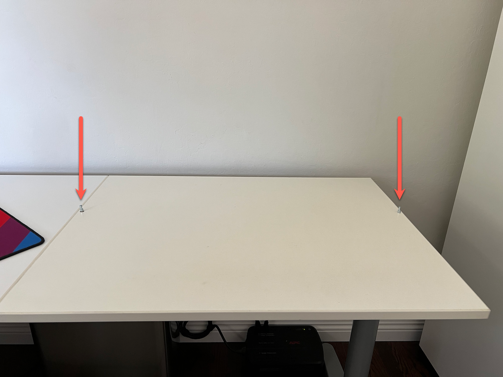

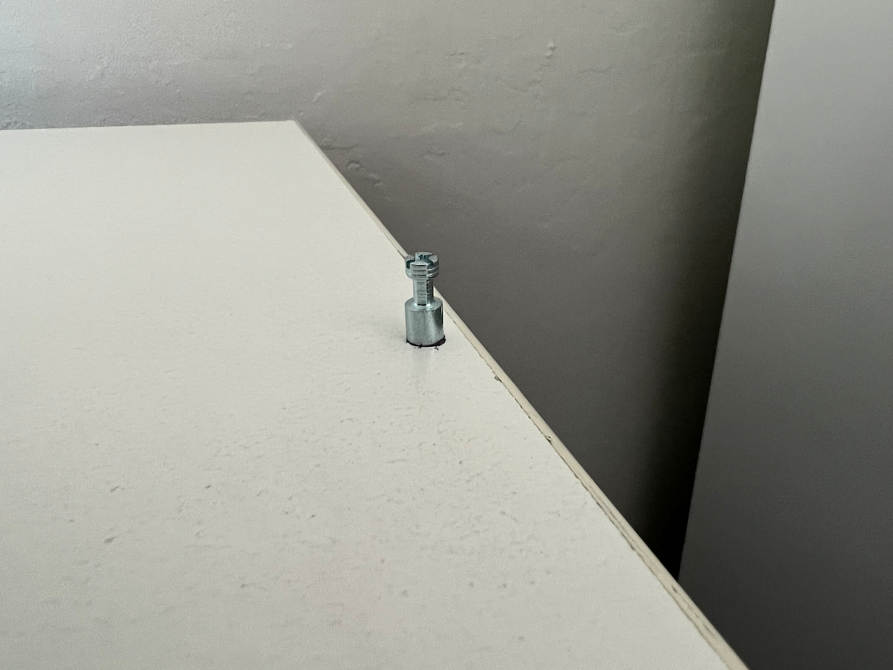

Once the cam-lock screws were installed, it was easy to secure the shelf to the desk extension.

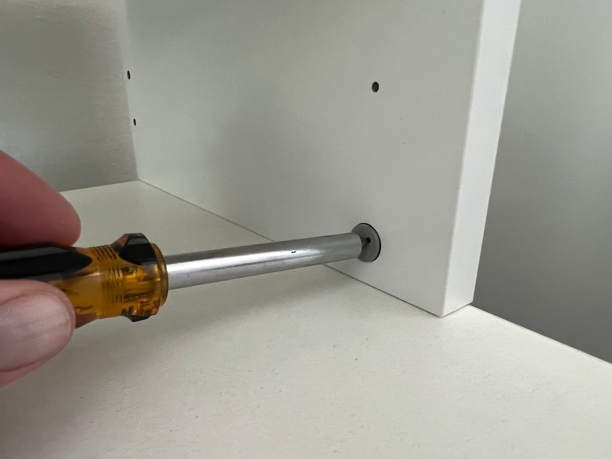

Fits perfectly!

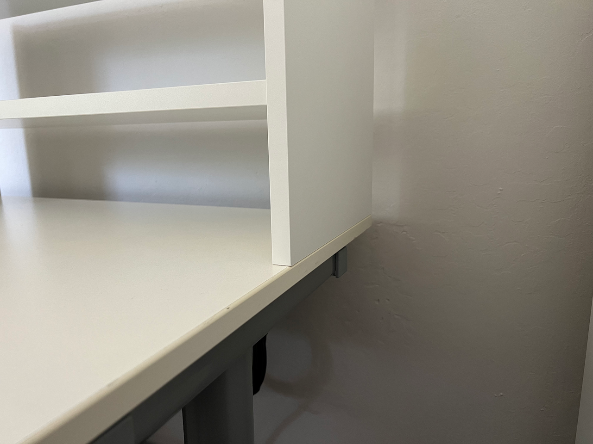

I chose not to install the rear panel of the BILLY shelves because some of the test gear is a bit longer than the depth of the shelf, and the power supply cables need a way to exit the rear of the shelf.

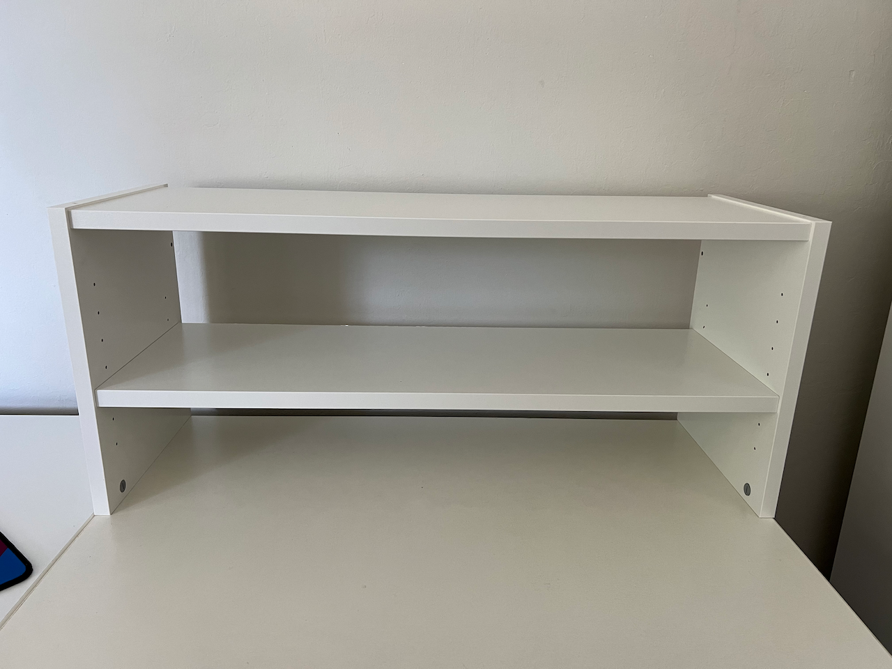

## Creating an ESD Protected Area

I wanted to reduce the risk of an [electrostatic discharge (ESD)](https://en.wikipedia.org/wiki/Electrostatic_discharge) event damaging a board.  This involved setting up an [“ESD Protected Area” (EPA)](https://scs-static-control-solutions.blog/2018/10/18/how-to-create-an-esd-protected-area-at-an-existing-workstation/) with a grounded anti-static worksurface mat and wrist strap.

[ESD matting](https://www.antistat.co.uk/blog/2017/12/05/everything-need-know-esd-matting-probably/) is designed to drain any buildup of static charge from items placed on its surface.  It can be made with either vinyl or rubber, or a combination of the two (known as "Homogenous").  Vinyl mats are the most widely used because they are cost-effective, easy to cut to shape and provide excellent static dissipation.  The vinyl matting comes in 2 or 3-layers, where the 3-layer has better electrical properties, but is more expensive.  I'd recommend going with a 3-layer vinyl mat unless you need the high resistance to heat and chemicals of rubber mats.

[ESD wrist straps](https://scs-static-control-solutions.blog/2017/11/30/an-introduction-to-wrist-straps/) are designed to provide a safe electrical connection between your skin and common workstation ground point.  For safety, the wrist straps have a 1MΩ resistor which limits the current in case of an accidental contact with high voltages up to 250VAC.  They can come in a variety of band styles: [metal](https://store.unitedesd.com/WS_1037_Metal_Expansion_Plastic_Encapsulated_Wrist_p/ws-1037.htm), [cloth](https://store.unitedesd.com/WS_1020_Premium_ESD_Wrist_Strap_p/ws-1020.htm), or [gel](https://store.unitedesd.com/ESD_Gel_Wrist_Strap_and_Coil_Cord_p/w00404.htm).  I find the cloth bands to be the most comfortable, but they are cheap enough that you could pick up one of each and decide what works best for you.

I ended up purchasing a [Bertech ESD Anti-Static Vinyl Mat Kit (3059-24x30BKT)](https://www.amazon.com/gp/product/B08722C28D) because it comes with the mat and the wrist strap as a kit, and it fits *PERFECTLY* in the 30" width of the IKEA shelf (no cutting required):

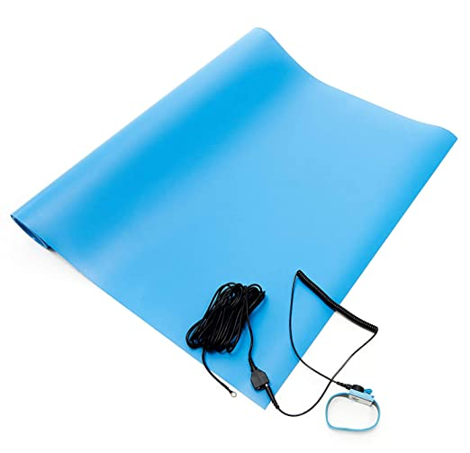

I used some velcro tape to secure the mat to the desktop:

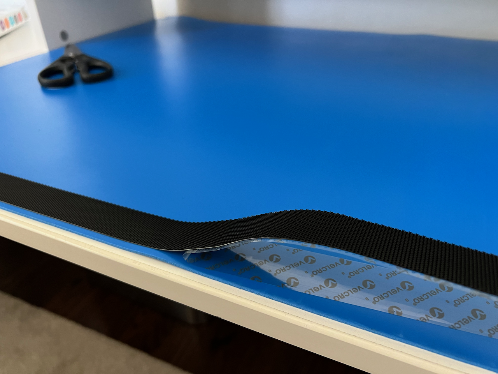

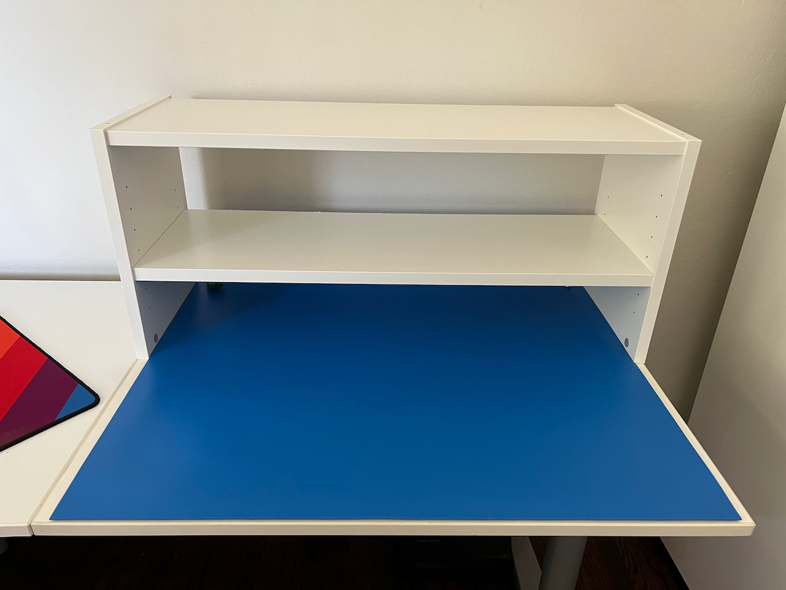

**How do we ground the mat?**

The mat kit comes with a grounding cord that connects the 10mm snap on the mat to an "eyelet" (a #10 ring terminal) for a screw connection to earth ground.  Many NEMA 5-15R power outlets in the US have a center screw that can be used for this purpose.

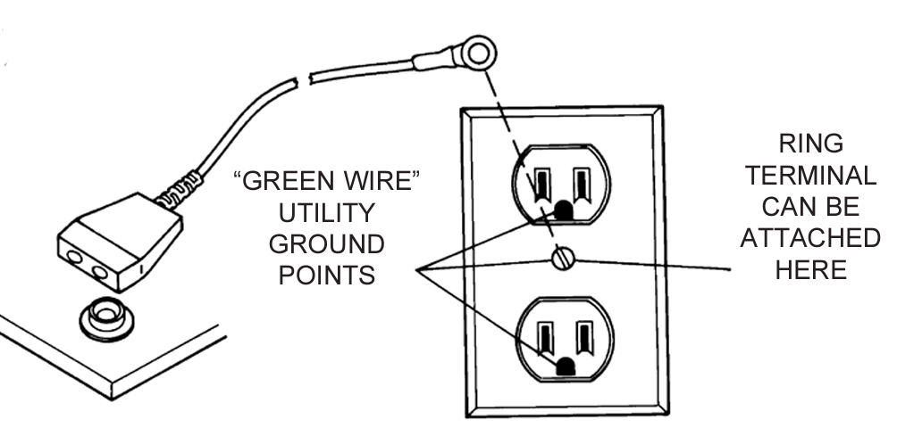

However, I wanted an easier/cleaner way to ground the mat to the power strip under my desk, so I purchased a [Prostat PGC-015Q Green Ground Cord & Qube](https://www.amazon.com/dp/B0060AG7W4) adapter.  The "Qube" grounded plug adapter comes with a banana jack cable to connect the 10mm snap on the mat to the outlet common ground.  The wrist strap can be connected to one of the two female banana jack receptacles on the green ground cord:

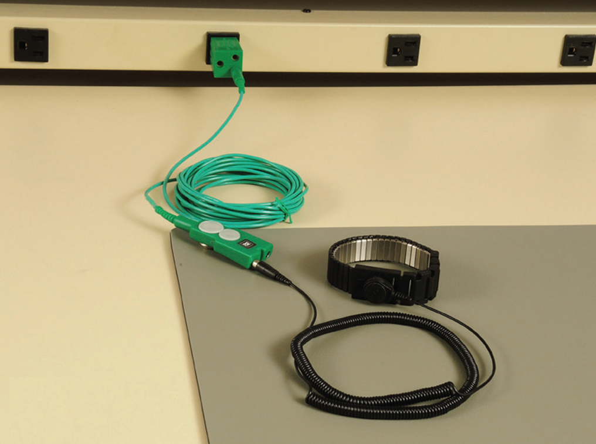

Once everything is properly connected, you and your workstation should be at the same electrical potential as earth ground.

**But wait... how do you ensure that everything is properly grounded, and more importantly, *stays* grounded over time?**

There are devices that can continuously monitor both the ESD mat and wrist strap's connection to ground, and provide an audible alert if one of those connections fails.  These continuous monitors are generally classified by whether they use a [single-wire vs. dual-wire](https://scs-static-control-solutions.blog/2017/12/14/comparing-single-wire-and-dual-wire-monitors/) wrist strap.  Dual-wire monitors were developed to address some of the problems with single-wire wrist straps, but are more expensive ($200+).  Some of the newer single-wire monitors (like the [Aratron AEI-DT020](https://www.aratron.us/aei-dt020.htm)) have a dual threshold capability that can also detect failure of the safety resistor in the wrist strap, in addition to monitoring the ground connection.

**So what should you get?**

If I was drowning in cash, I'd grab a fancy dual-wire monitor like the [SCS CTC331-WW](https://staticcontrol.descoindustries.com/SCSCatalog/Static-Control-Monitors/Workstation-Monitors/Iron-Man-Plus-Monitor/CTC331-WW/#.YrAAlezMI0Q) which has an additional monitoring channel for detecting overvoltage events from hand tools touching the PCB (soldering iron, tweezers, etc).  This is probably overkill for most home labs.

If I was purchasing a brand new single-wire monitor in the $100 range, I'd buy the following dual threshold monitor kit:

- [Aratron AEI-DT020](https://store.unitedesd.com/ESD_Wrist_Strap_and_Mat_monitor_dual_threshold_p/dt-020.htm)
- [Metal Mounting Bracket for the ST or DT 020 Series](https://store.unitedesd.com/wrist_strap_monitor_metal_mounting_bracket_p/9202-brk.htm) (mounts the monitor to the underside of the desk)
- [Secure Monitor to Mat Adapter for the DT and ST Series](https://store.unitedesd.com/ESD_Wrist_strap_constant_monitor_single_threshold_p/gc-mini.htm) (connects the monitor directly to the 10mm snap on the mat)

However, I'm cheap... so, I found a broken [Botron B9202](https://www.botron.com/product/single-operator-and-mat-continuous-monitor/) single-wire monitor on eBay for $15, and fixed the broken BNC jack myself:

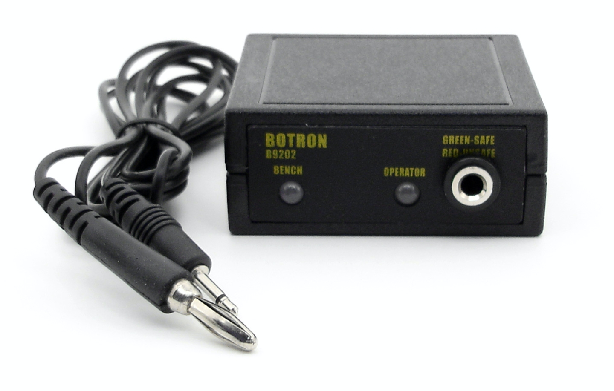

**OK, so how do we hook this Continuous Monitor up?**

Here's the connection diagram for the [Aratron AEI-ST020](https://www.aratron.us/aei-st020.htm) (which is functionally identical to the Botron B9202):

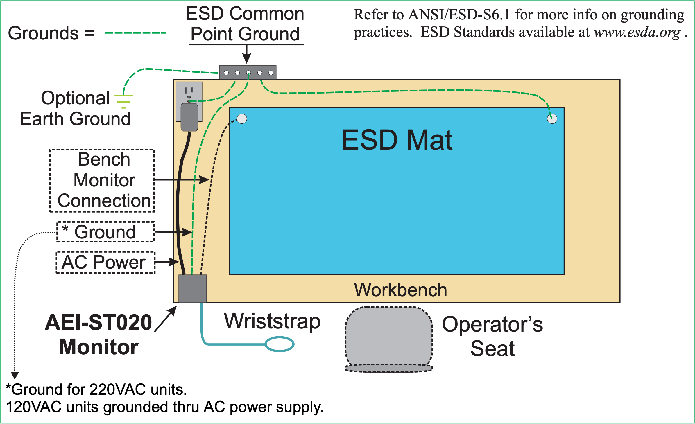

1. Connect the included power supply to the monitor and to a grounded power outlet (the unit is grounded through the power supply for 120VAC units)
2. Connect the "Bench System Ground" connection on the monitor to one of the 10mm snaps on the ESD mat.  If you want to use the included cable, you'll need to pick up some banana jack-to-10mm adapters (e.g. [Transforming Technologies CS0127](https://www.digikey.com/short/qj91q8zh)).  Alternatively, you can use one of these cables: [Secure Monitor to Mat Adapter for the DT and ST Series](https://store.unitedesd.com/ESD_Wrist_strap_constant_monitor_single_threshold_p/gc-mini.htm)
3. Connect the Prostat grounding cable to the other 10mm snap on the ESD mat
4. Plug the wrist strap into the "Operator" banana jack connection on the front of the monitor

**An ESD intermission**

If you want the most...shall we say..."entertaining" and informative introduction to ESD, check out this video from the inventor of the original pink poly ESD bag:

