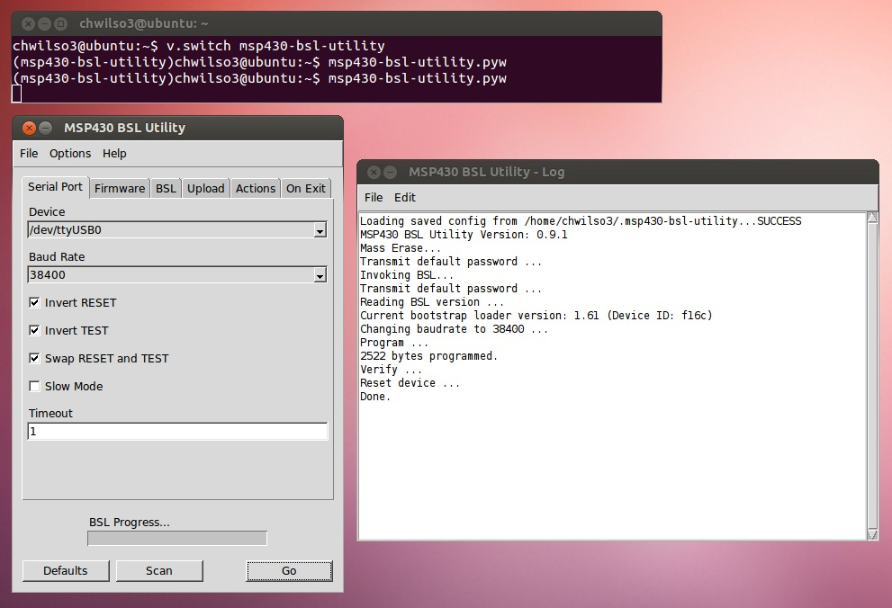

# MSP430 BSL Programmer

##### FCD-PRG01

The FCD-PRG01 is a USB bootstrap loader (BSL) programmer for the Texas Instruments MSP430 microcontroller. For designs where low cost or small form factor prohibit the integration of custom programming logic or a large JTAG header, the FCD-PRG01 enables in-system programming by including a single 6 pin header in the target device design.

Designed to work with the [cross platform MSPGCC toolchain](https://launchpad.net/python-msp430-tools/), the FCD-PRG01 provides an open source, cross platform alternative to platform dependent development tools for the MSP430 microcontroller.

The FCD-PRG01 integrates a USB-to-serial converter and on board regulated power supply into a small USB dongle, allowing programming and test capability over a single interface. It exposes a standard 6 pin, 0.1" header which can be used to interface to the target board via a device specific cable harness. This modular approach provides designers with the flexibility to select the optimal physical programming interface for the unique design constraints of each target platform.

**Datasheet:** [fcd-prg01-f.pdf](https://github.com/flyingcampdesign/msp430-bsl-programmer/raw/master/docs/datasheets/release/fcd-prg01-f.pdf)

**Open-source EAGLE Design Files:** https://github.com/flyingcampdesign/msp430-bsl-programmer 

#### FCD-CBL01

A programming cable harness which mates with standard 3x2, 2mm PCB headers. See FCD-CBL01 Programming Cable schematic for pinout. The [Flying Camp Design EAGLE repository](https://github.com/flyingcampdesign/eagle) contains CAD symbols for the mating headers recommended in the FCD-PRG01 datasheet.

## MSP430 BSL Utility

Open Source GUI utility for for communication with 1/2/4xx BSLs via a serial port. Designed to work with our MSP430 BSL Programmer USB dongle.

The MSP430 BSL Utility is not currently under active development. A Windows build is available below for customers wishing to evaluate the MSP430 BSL Programmer. Although this utility has been tested, it should not be used in a production environment.

**Windows Installer:** [msp430_bsl_utility_setup_0.9.1.exe](https://github.com/flyingcampdesign/msp430-bsl-utility/releases/download/0.9.1/msp430_bsl_utility_setup_0.9.1.exe)

**Open-source software:** https://github.com/flyingcampdesign/msp430-bsl-utility

## TI BSLDEMO

BSLDEMO2.exe is a is a command line demo utility for communication with 1/2/4xx BSLs distributed in[ http://www.ti.com/lit/zip/slau319](http://www.ti.com/lit/zip/slau319). The download below has been patched and recompiled to work with the FCD-PRG01 + FCD-CBL01 hardware.

**Windows EXE:** [bsldemo.zip](https://github.com/flyingcampdesign/BSL_Files/releases/download/v0.1.0/bsldemo.zip)

**Open-source software:** https://github.com/flyingcampdesign/BSL_Files